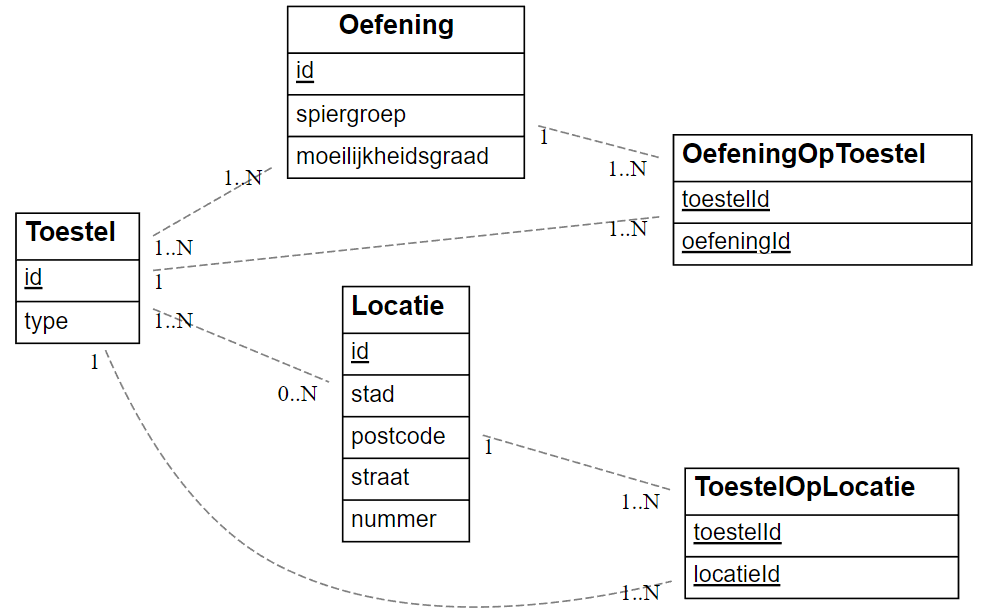
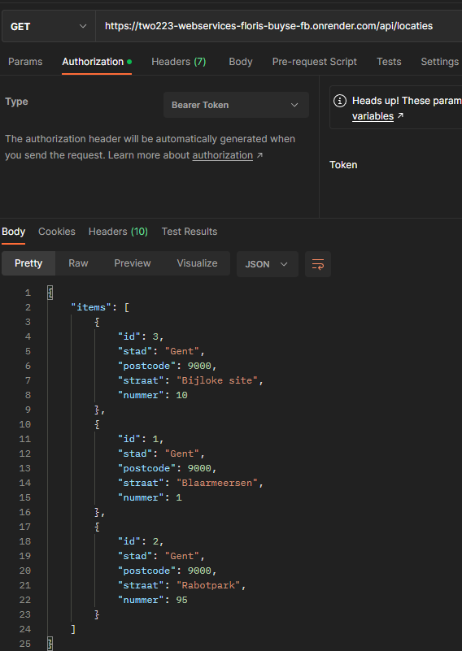
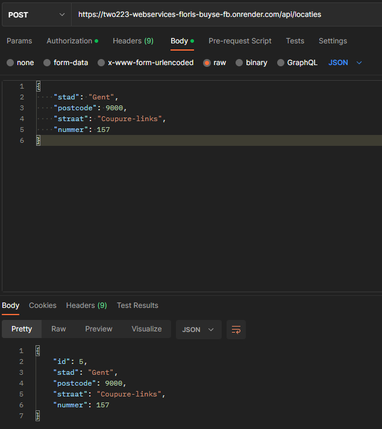
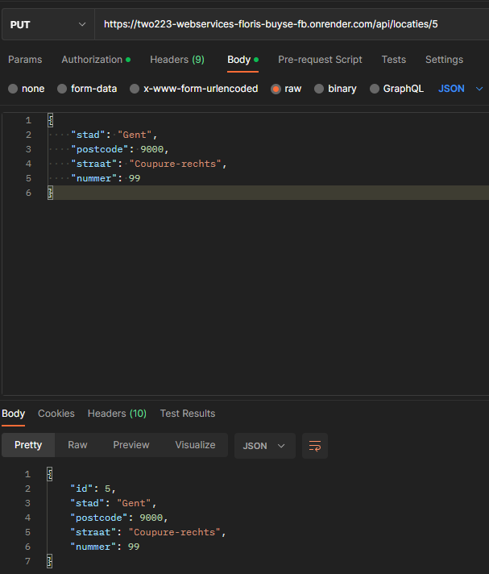
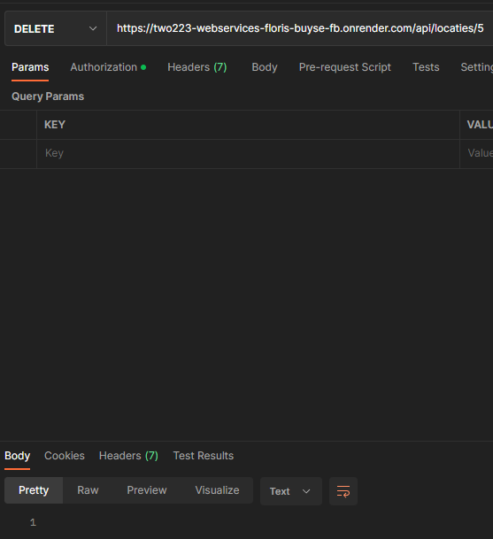
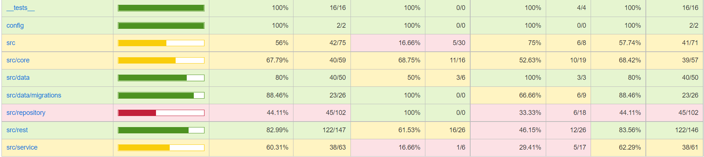
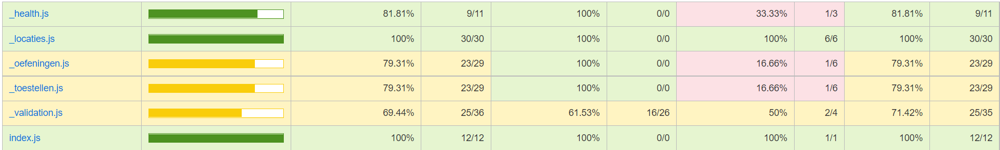

# Floris Buyse (202080000)

- [ ] Web Services: GITHUB URL
  - [GitHub repository](https://github.com/Web-IV/2223-webservices-Floris-Buyse-FB)

**Logingegevens**

- Gebruikersnaam/e-mailadres: e2e-testing@openluchtfitness.be
- Wachtwoord: OpenluchtIsKool12345

## Projectbeschrijving

Met mijn API kan je locaties van openlucht fitness ruimtes krijgen. Je kan ook zien welke toestellen er staan en welke oefeningen je op deze toestellen kan uitvoeren.

## Screenshots

## Behaalde minimumvereisten

### Web Services

- **datalaag**

  - [ X ] voldoende complex (meer dan één tabel)
  - [ X ] één module beheert de connectie + connectie wordt gesloten bij sluiten server
  - [ X ] heeft migraties
  - [ X ] heeft seeds
 

- **repositorylaag**

  - [ X ] definieert één repository per entiteit (niet voor tussentabellen) - indien van toepassing
  - [ X ] mapt OO-rijke data naar relationele tabellen en vice versa
 

- **servicelaag met een zekere complexiteit**

  - [ X ] bevat alle domeinlogica
  - [ X ] bevat geen SQL-queries of databank-gerelateerde code
 

- **REST-laag**

  - [ X ] meerdere routes met invoervalidatie
  - [ X ] degelijke foutboodschappen
  - [ X ] volgt de conventies van een RESTful API
  - [ X ] bevat geen domeinlogica
  - [ X ] degelijke authorisatie/authenticatie op alle routes
 

- **varia**
  - [ X ] een aantal niet-triviale testen (min. 1 controller >=80% coverage)
  - [ X ] minstens één extra technologie
  - [ X ] duidelijke en volledige `README.md`
  - [ X ] maakt gebruik van de laatste ES6-features (object destructuring, spread operator...)
  - [ X ] volledig en tijdig ingediend dossier

## Projectstructuur

### Web Services

Er is een src, een screenshots_dossier map, een docs map, een coverage map, een config map en een tests map.

- In de src map kan je de verschillende lagen van de apllicatie vinden  (REST, data, service, repository).

- In de screenshots_dossier map kan je de gebruikte screenshots vinden van het dossier.

- In de docs map kan je een html file vinden, die wanneer je deze in de liveserver beschouwd, je de api documentatie geeft.

- In de coverage map kan je een html file vinden, die wanneer je deze in de liveserver beschouwd, je de test coverage toont.

- In de config map kan je de evironmental variables vinden.

- In de tests map kan je alle test suites vinden.

## Extra technologie

### Web Services

Ik heb ervoor gekozen om een andere package voor API documentatie te gebruiken. Ik gebruik namelijk apiDoc in plaats van Swagger.

[LINK NPM](https://www.npmjs.com/package/apidoc)

## Testresultaten

### Web Services

Ik heb een test voor locaties, toestellen en oefeningen. Hierbij test ik de CRUD-operaties, met authenticatie en validatie.

## Gekende bugs

### Web Services

Ik heb momenteel alleen een locaties.spec.js staan. Ik had ook toestellen en oefeningen toegevoegd maar als ik deze ook had toegevoegd kreeg ik een error namelijk: "knex is not a fucntion". Hierdoor failen de migrations en bijgevolg falen de testen ook. Ik heb hiervoor nog geen oplossing gevonden.

